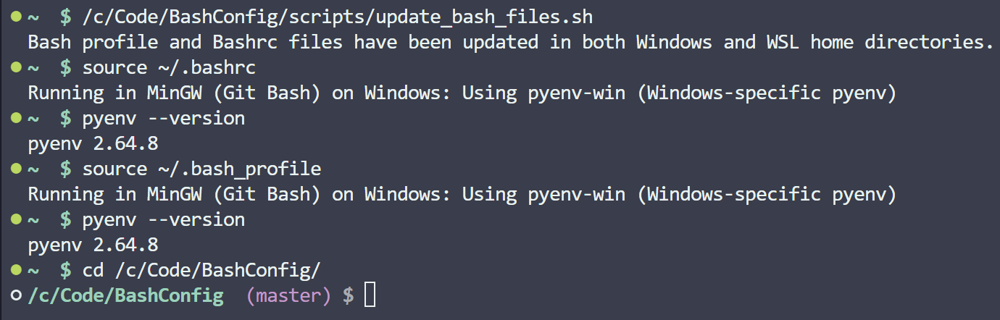
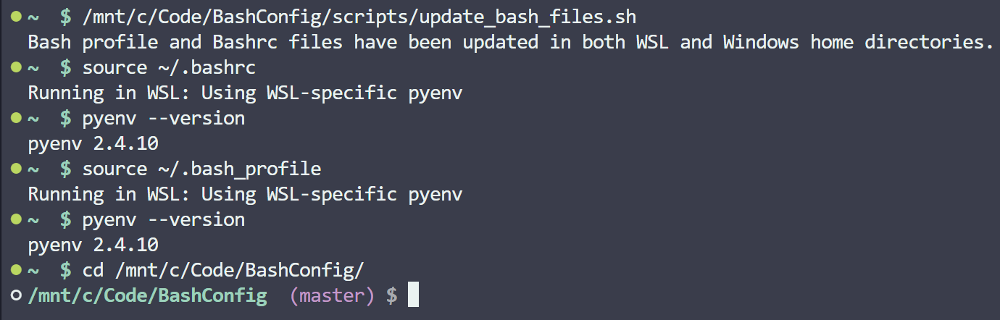

# Bash Configuration Synchronization Script

This project provides a set of scripts designed to synchronize and configure the `.bashrc` and `.bash_profile` files across both WSL (Windows Subsystem for Linux) and native Windows environments. This is particularly useful for users who work in both environments using VSCode or any other terminal emulator on Windows, such as MinGW (Git Bash).

## Overview

The main script, `update_bash_files.sh`, automates the process of copying the appropriate configuration files to your home directory in both WSL and Windows environments. This ensures that your terminal configurations are consistent, regardless of which environment you're working in.

### Key Features

- **Automatic Username Detection**: The script attempts to detect your Windows and WSL usernames automatically. If it cannot find them, it will prompt you to enter them manually.
- **Environment-Specific Configurations**: There are separate `.bashrc` and `.bash_profile` files for each environment (WSL and Windows). Currently, these configurations are mirrored, but they can be customized individually if needed.
- **Cross-Environment Compatibility**: The `update_bash_files.sh` script can be run from either the Windows or WSL environment, and it will correctly update the configuration files in both environments.
- **pyenv Support**: The script correctly sets up `pyenv` for both environments, using `pyenv-win` in Windows and the standard `pyenv` in WSL (Ubuntu/Linux). This ensures that you can manage Python versions seamlessly in either environment.

### How It Works

1. **Running the Script**:
   - Run the `update_bash_files.sh` script from either the WSL or Windows environment.
   - The script will automatically detect which environment it's running in and update the corresponding `.bashrc` and `.bash_profile` files.
   - If it cannot detect your username, it will prompt you to enter it.

2. **Configuration Files**:
   - The script copies the relevant configuration files from the `config/` directory to the appropriate home directories (`~`) in WSL and Windows.
   - Currently, there are four configuration files:
     - `config/wsl/.bashrc_wsl`
     - `config/wsl/.bash_profile_wsl`
     - `config/windows/.bashrc_win`
     - `config/windows/.bash_profile_win`

3. **Environment Detection**:
   - The script uses the `uname` command to detect whether it’s running in WSL or a native Windows environment (MinGW/Git Bash).
   - Based on this detection, it sets up the path variables correctly to ensure that the appropriate version of `pyenv` is used.

### Screenshots

Here’s a demonstration of the script working in both environments:

1. **Windows Environment**:
   

   The screenshot above shows the script running in the Windows environment, specifically in MinGW (Git Bash). After sourcing the `.bashrc` and `.bash_profile` files, you can see that `pyenv-win` is correctly initialized.

2. **WSL Environment**:
   

   The screenshot above shows the script running in WSL (Ubuntu on Windows). Similarly, after sourcing the `.bashrc` and `.bash_profile` files, the Linux version of `pyenv` is correctly initialized.

   The updated prompt, which includes the full path and any Git branch information, is also shown after changing directories.

### Setting Up Your System

To use this script:

1. **Clone the Repository**:
   ```bash
   git clone <repository-url>
   ```

2. **Ensure you have MinGW (Git Bash) Installed**:
   - Install Git for Windows, which includes Git Bash. This will allow you to run the script in a Windows environment.

3. **Install `pyenv`**:
   - **Windows (pyenv-win)**:
     - Follow the installation instructions for `pyenv-win` [here](https://github.com/pyenv-win/pyenv-win#installation).
   - **WSL (Linux)**:
     - Install `pyenv` in WSL by following the instructions [here](https://github.com/pyenv/pyenv#installation).
     - You can also use a simple installer script:
       ```bash
       curl https://pyenv.run | bash
       ```

4. **Run the Script**:
   - In either WSL or Git Bash, navigate to the `scripts/` directory in the cloned repository and run:
     ```bash
     ./update_bash_files.sh
     ```

5. **Verify the Configuration**:
   - After running the script, you can verify that the configurations are correctly applied by sourcing your `.bashrc` and `.bash_profile` files:
     ```bash
     source ~/.bashrc
     source ~/.bash_profile
     ```

### Additional Information

- The `~` symbol is a shortcut to the home directory in both WSL and Windows environments. This is a common convention in Unix-like systems, and users working with these scripts are likely familiar with it.

- Feel free to modify the configuration files in the `config/` directory to suit your specific needs. While they currently mirror each other, you can create environment-specific configurations if necessary.

### Contributing

If you find any issues or have suggestions for improvement, feel free to open an issue or submit a pull request.
